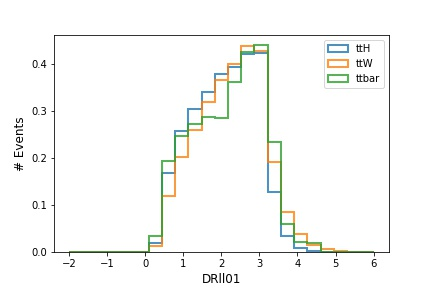

# Transform root ntuples to "industry-conventional" format

## Convert root to dataframe
`access_root.ipynb` - use uproot to convert root to `pandas` DataFrame.

Load signal/backgorund, check consistency of the content, plot variables for overlaid Signal and Background:

## Convert to csv and HDF5
Use built in functions of `pandas` to suitable format. (updated after removing cuts of 10k events)
 * root
     * ttH.root 7.7M 
     * ttW.root 9.7M
 * CSV:
     * ttH.csv  26M  
     * ttW.csv  32M  
 * [HDF5](https://www.hdfgroup.org/solutions/hdf5/):
     * ttH.h5  13M  
     * ttW.h5  16M
&rarr; HDF5 2 times more efficient than CVS in terms of space, while root is still more optimal
